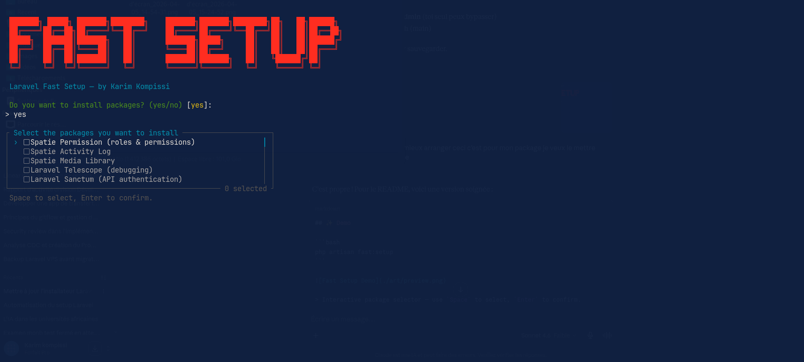

# Laravel Fast Setup

**Laravel Fast Setup** is a developer tool that automates the most repetitive tasks when starting a new Laravel project: package installation, environment file generation, and folder structure scaffolding — all through an interactive CLI wizard.



---

## Features

- Interactive setup wizard via `php artisan fast:setup`
- Multi-select package installation with spacebar (powered by [Laravel Prompts](https://laravel.com/docs/prompts))
- Automatic post-install actions (publish assets, run migrations)
- `.env` file generation for `local`, `staging`, and `production`
- Folder structure scaffolding based on your config
- Fully configurable via `config/fast-setup.php`

---

## Requirements

- PHP `^8.3 | ^8.4`
- Laravel `^12.0 | ^13.0`

---

## Installation

Install the package via Composer:

```bash
composer require karimalik/laravel-fast-setup
```

Publish the configuration file:

```bash
php artisan vendor:publish --tag=fast-setup-config
```

---

## Usage

### Full wizard

Run the interactive wizard that guides you through all setup steps:

```bash
php artisan fast:setup
```

### Individual commands

You can also run each step independently:

```bash
# Select and install packages interactively
php artisan fast:install-packages

# Generate .env files for one or multiple environments
php artisan fast:generate-env

# Scaffold your preferred folder architecture
php artisan fast:generate-structure
```

---

## Configuration

After publishing, edit `config/fast-setup.php` to customize:

### Packages

Define the packages available for installation and their post-install actions:

```php
'packages' => [
    'spatie/laravel-permission' => [
        'name'         => 'Spatie Permission (roles & permissions)',
        'post_install' => [
            'publish' => '--provider="Spatie\Permission\PermissionServiceProvider"',
            'migrate' => true,
        ],
    ],
    'laravel/telescope' => [
        'name'         => 'Laravel Telescope (debugging)',
        'post_install' => [
            'artisan' => 'telescope:install',
            'migrate' => true,
        ],
    ],
],
```

Each package entry supports the following `post_install` keys:

| Key | Type | Description |
|---|---|---|
| `artisan` | `string` | Artisan command to run after install (e.g. `telescope:install`) |
| `publish` | `string` | Arguments passed to `vendor:publish` |
| `migrate` | `bool` | Run `php artisan migrate` after install |

### Folder structures

Define one or more named folder structures to scaffold inside your project:

```php
'structures' => [
    'domain' => [
        'app/Domain/User',
        'app/Domain/Order',
        'app/Services',
    ],
    'modular' => [
        'app/Modules/Auth',
        'app/Modules/Dashboard',
    ],
],
```

---

## License

MIT — [Karim Kompissi](https://github.com/karimalik)
